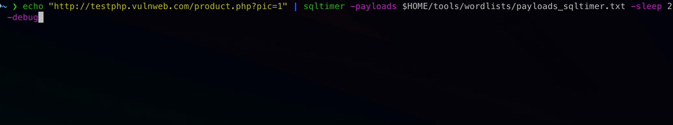

# sqltimer 🕵️‍♂️

A fast, minimalistic scanner for **time-based SQL injection (SQLi)** detection – built in Go.

---



---

## ✨ Features

### 🛡️ Detection Engine

* ⚡ **Time-based SQL Injection detection** via precise `sleep(n)` delta measurement.
* 🧐 **Drift-tolerant detection** using `-negdrift` / `-posdrift` to handle real-world network jitter.
* ❌ **False-positive control** with `-maxtime` to skip outliers.
* 🚦 **Stop-at-first-match** with `-spm` to minimize redundant testing.

### 🧪 Payload Handling

* 🎯 **Dynamic payloads** using `{SLEEP}` placeholders, automatically replaced at runtime.
* 🌐 **Auto-encoding** for payloads with spaces unless `-encode` is explicitly set.
* 📥 **Payload validation**: skips empty lines, comments (`#`), and lines without `{SLEEP}`.
* 🔧 Debug output for ignored/auto-encoded payloads (line number, reason).

### 🌐 Request Customization

* 🔁 Supports **GET** and **POST** methods with `-post` flag.
* 👤 Custom **User-Agent** string via `-user-agent`.
* 🎭 **User-Agent header injection** (`-add-ua`) to test payloads through headers.
* 📂 Support for multiple **custom headers** with `-header "Key:Value"`.

### 🔗 Proxy & Replay

* 🔗 Full **proxy support** with `-proxy`.
* 🔁 **Replay proxy** for vulnerable findings only (`-replay-proxy`).
* 🛠️ Modular replay engine supports full POST replay with correct content types and headers.

### 🧵 Performance & Control

* 🧵 **Multi-threaded scanning** using `-threads` to control concurrency.
* 💤 Adjustable **delay between requests** with `-delay`, applies to base and payloads.
* ⏳ **Adaptive timeout** calculated using `sleep * timeoutmultiplier + timeoutbuffer`.

### 🧼 Output & UX

* 🧹 **Clean mode** (`-clean`) to output only vulnerable URLs (ideal for piping).
* 🔔 Integration with **ProjectDiscovery notify** for real-time alerts (`-notify`).
* 🔧 **Color-coded debug logs** with detailed CLI feedback (`-debug`).
* 📛 **Legend, banners, and prefixes** for clean, readable output.

### 📥 Input Validation

* 🚫 Skips **invalid or malformed URLs** from stdin (with debug messages).
* ✅ Ensures payloads in file are syntactically valid and informative when skipped.

---

## 📦 Installation

Requires **Go 1.18+**

```bash
go install github.com/c1phy/sqltimer/cmd/sqltimer@latest
```

The binary `sqltimer` will be available in your `$GOBIN` directory.

---

## 🚀 Quick Start

### 1. Prepare a list of target URLs

Each URL must contain at least one GET parameter:

```txt
https://target.com/page?id=1
https://site.org/search?q=test
```

Save as `urls.txt`.

---

### 2. Create your payloads (with `{SLEEP}` placeholder)

```txt
(select*from(select(sleep({SLEEP}))a)
' OR sleep({SLEEP}) --
1') AND SLEEP({SLEEP}) AND ('1'='1
" OR sleep({SLEEP})) --
```

Save as `payloads.txt`.

> `{SLEEP}` will be replaced dynamically based on the `-sleep` parameter, e.g., `sleep(10)`

---

### 3. Run the scan

```bash
cat urls.txt | sqltimer -payloads payloads.txt -sleep 10 -threads 20 -encode -notify
```

---

## 📁 Example Directory Structure

```
sqltimer/
├── payloads.txt
├── urls.txt
└── sqltimer (binary from go install or build)
```

---

## ✅ Example Output

```bash
🔥 SQLi suspicion in param 'q' with payload '(select*from(select(sleep(10)))a)' → https://example.com/search?q=test (Δ=10.2s ≈ 1x sleep ±0.1s/0.5s)
```

---

## 🛠 Options

## 🛠 Options

| Flag                    | Description                                                    | Default      |
|-------------------------|----------------------------------------------------------------|--------------|
| **General Options**     |                                                                |              |
| `-payloads`             | Path to payload list (required)                                | –            |
| `-version`              | Show current sqltimer version and exit                         | `false`      |
| **Scan & Timing**       |                                                                |              |
| `-sleep`                | Sleep duration injected in payloads (in seconds)               | `10`         |
| `-negdrift`             | Allowed negative timing drift from expected sleep              | `0.1`        |
| `-posdrift`             | Allowed positive timing drift from expected sleep              | `0.5`        |
| `-maxtime`              | Maximum allowed delta time before a response is skipped        | `30.0`       |
| `-timeoutmultiplier`    | Multiplier to calculate HTTP timeout based on sleep time       | `6`          |
| `-timeoutbuffer`        | Additional seconds added to calculated timeout                 | `10`         |
| `-threads`              | Number of concurrent scan workers                              | `10`         |
| `-delay`                | Delay between individual HTTP requests (in seconds)            | `0`          |
| `-spm`                  | Stop scanning after the first matching payload per URL         | `false`      |
| `-add-ua`               | Also inject payloads via the `User-Agent` header               | `false`      |
| **Request & Proxy**     |                                                                |              |
| `-proxy`                | Send all traffic through the specified HTTP proxy              | –            |
| `-replay-proxy`         | Replay only detected hits through proxy for deeper inspection  | –            |
| `-user-agent`           | Custom User-Agent string                                       | Firefox 124  |
| `-header`               | Add custom header (`Key:Value`). Can be used multiple times    | –            |
| `-post`                 | Use POST method for payload delivery (default is GET)          | `false`      |
| `-encode`               | Fully URL-encode payloads before injection                     | `false`      |
| **Output & Debug**      |                                                                |              |
| `-notify`               | Send hits to [notify](https://github.com/projectdiscovery/notify) | `false`   |
| `-debug`                | Enable detailed debug output with timing and decisions         | `false`      |
| `-nocolor`              | Disable color-coded terminal output                            | `false`      |
| `-clean`                | Output only vulnerable URLs (good for tool chaining)           | `false`      |

---

## 🎯 How Drift Works (`-negdrift` and `-posdrift`)

The `-negdrift` and `-posdrift` options define how much timing deviation is tolerated when matching the sleep time against the server's real delay.

### ✍️ Example

- `-sleep 2`
- `-negdrift 0.1`
- `-posdrift 0.5`

### 📊 Drift Detection Table

| Expected Sleep | Match Range    | Observed Delta | Detected? | Reason                          |
|----------------|----------------|----------------|-----------|---------------------------------|
| 2×1 (2s)       | 1.9s - 2.5s     | 2.3s           | ✅         | within 1x sleep window          |
| 2×2 (4s)       | 3.9s - 4.5s     | 3.9s           | ✅         | within 2x sleep window          |
| 2×2 (4s)       | 3.9s - 4.5s     | 4.3s           | ✅         | within 2x sleep window          |
| 2×3 (6s)       | 5.9s - 6.5s     | 5.7s           | ❌         | too far off, not matching       |
| 2×3 (6s)       | 5.9s - 6.5s     | 6.4s           | ✅         | within 3x sleep window          |
| 2×4 (8s)       | 7.9s - 8.5s     | 7.5s           | ❌         | too far off, not matching       |

---

## ⏳ How HTTP Timeout Works

Sqltimer dynamically sets the HTTP client timeout based on your `-sleep` parameter:

```
timeout = (sleep × timeoutmultiplier) + timeoutbuffer
```

Example:
- `-sleep 2`
- `-timeoutmultiplier 6`
- `-timeoutbuffer 10`

Resulting Timeout:
```bash
(2 × 6) + 10 = 22 seconds
```

This ensures slow SQLi payloads are not cut off prematurely but keeps the scanner responsive.

---

## 🔔 Integration with `notify` (optional)

Install [`notify`](https://github.com/projectdiscovery/notify):

```bash
go install github.com/projectdiscovery/notify/cmd/notify@latest
```

Configure it (Slack, Discord, Telegram) via `~/.config/notify/provider-config.yaml`.

Then simply use:

```bash
cat urls.txt | sqltimer -payloads payloads.txt -notify
```

All matches will be piped into your `notify` pipeline automatically.

---

## ❤️ Usage Tips

### 🎯 Detection Accuracy

* Use a higher `-sleep` value (e.g., `10`) for more reliable detection.
* For stable networks, keep default drift settings: `-negdrift 0.1` and `-posdrift 0.5`.
* In noisy environments (e.g., cloud targets), increase `-posdrift` slightly (e.g., `0.6`) to reduce false negatives.
* Use `-debug` to trace timing behavior and fine-tune drift or delays.

### 🧪 Payload Strategies

* Enable `-add-ua` to test payloads in the **User-Agent** header.
* Switch to `-post` if GET-based payloads are filtered or blocked by the server.
* Use `-spm` (stop-after-match) to reduce noise and scan faster by skipping further payloads once a hit is found.

### 🔗 Integration & Automation

* Pipe input from tools like [`waybackurls`](https://github.com/tomnomnom/waybackurls), [`gau`](https://github.com/lc/gau), or [`ffuf`](https://github.com/ffuf/ffuf).
* Combine with `-clean` for chaining into other tools:

  ```bash
  sqltimer ... -clean | awk '{print $1}'
  ```

### 🌐 Proxy & Replay

* Use `-proxy` to send **all** traffic through a proxy (e.g., Burp/ZAP).
* Use `-replay-proxy` to send only detected **vulnerable requests** through a secondary proxy for logging, inspection, or exploitation.
* If both are specified, `-proxy` takes precedence and is used for all traffic.

### ⚙️ Customization

* Set a custom `-user-agent` to blend in or bypass basic filters.
* Use `-header "Key:Value"` one or more times to add arbitrary HTTP headers (e.g., auth tokens, X-Forwarded-For).
* Use `-delay` to slow down scanning for unstable targets or rate-limited endpoints (e.g., `-delay 2`).

---

## 🪪 License

MIT License – use it, improve it, share it.

---

## 🙋 About the Author

Marc-Oliver Munz – [munz4u.de](https://munz4u.de)

- 🌐 Website: [https://munz4u.de](https://munz4u.de)
- 🐦 Twitter/X: [@marcolivermunz](https://x.com/marcolivermunz)
- 🌀 Bluesky: [@munz4u.de](https://bsky.app/profile/munz4u.de)
- 💼 LinkedIn: [linkedin.com/in/marc-oliver-munz](https://www.linkedin.com/in/marc-oliver-munz/)

Feel free to connect, contribute, or give feedback!
